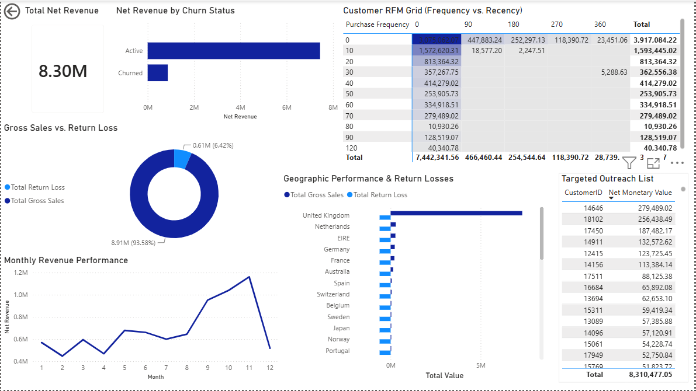
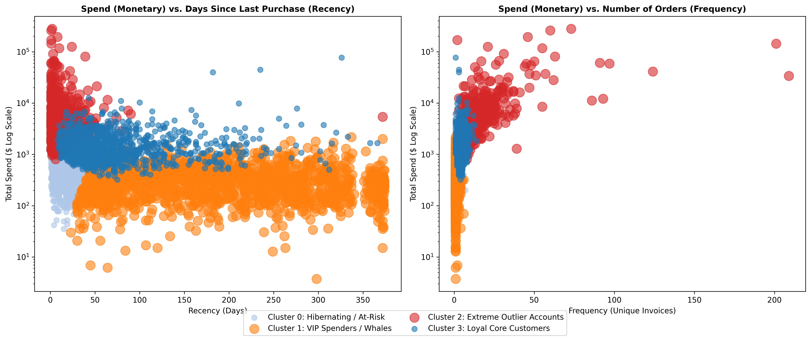

# Ecommerce Customer Analytics Pipeline

An end-to-end customer analytics solution built using **Python, MySQL, SQL, Machine Learning, and Power BI**.

The project transforms more than **540,000 ecommerce transactions** into actionable business insights through customer segmentation, revenue analysis, and interactive dashboards.

---

## Project Snapshot

| Metric | Value |
|--------|------:|
| Raw Transactions | 541,909 |
| Customers Analyzed | 4,372 |
| Customer Segments | 4 |
| Machine Learning | K-Means |
| SQL Scripts | 4 |
| Dashboard | Power BI |

---

## Dashboard Preview


# 1. Background & Business Problem

## Situation

The company generates a large volume of transactional data every day, yet raw transaction records alone provide limited insight into customer purchasing behavior and long-term business performance.

## Business Problem

Without customer segmentation, organizations struggle to identify their highest-value customers, detect churn risks, and allocate marketing resources efficiently.

Key business questions include:

- Who are the highest-value customers?
- Which customers are becoming inactive?
- How much revenue is generated after accounting for returns?
- How can customers be grouped into meaningful marketing segments?

## Project Objective

Build an end-to-end analytics pipeline that converts raw ecommerce transactions into business intelligence using Python, SQL, Machine Learning, and Power BI.
# 2. Data Structure

## Analytics Pipeline

```text
Raw Ecommerce Transactions
        │
        ▼
Python Data Cleaning
        │
        ▼
Clean Sales & Returns
        │
        ▼
MySQL Database
        │
        ▼
SQL Business Analysis
        │
        ▼
Customer Dimension Table
        │
        ▼
RFM Feature Engineering
        │
        ▼
K-Means Customer Segmentation
        │
        ▼
Power BI Dashboard
```

## Database Tables

| Table | Description |
|--------|-------------|
| sales_transactions | Completed sales |
| returns_transactions | Product returns |
| dim_customer_profiles | Customer-level RFM and churn metrics |

## Technology Stack

| Layer | Technology |
|--------|------------|
| Data Cleaning | Python |
| Database | MySQL |
| Analytics | SQL |
| Machine Learning | Scikit-Learn |
| Visualization | Power BI |
# 3. Executive Summary

The project transformed raw transactional data into an analytical customer model capable of supporting strategic business decisions.

Using SQL-based RFM feature engineering and a 4-cluster K-Means model, customers were segmented according to purchasing behavior.

The resulting Power BI dashboard provides executives with a centralized view of revenue performance, customer activity, return impact, and customer value.
# 4. Insights Deep Dive

## Revenue Performance

- Calculated corporate net revenue after accounting for product returns.
- Analyzed monthly revenue trends.
- Measured return losses alongside gross sales.

## Customer Analytics

Customer behavior was quantified using:

- Recency
- Frequency
- Net Monetary Value

These metrics formed the basis of customer segmentation.

## Customer Segmentation

The K-Means model identified four behavioral customer groups:

- Loyal Core Customers
- VIP Customers
- At-Risk Customers
- Extreme Outlier Accounts

The segmentation enables more targeted marketing and retention strategies.

## Customer Segmentation Visualization


# 5. Strategic Recommendations

Based on the analytical findings, the following actions are recommended:

- Prioritize retention efforts for high-value customers.
- Design personalized marketing campaigns using customer segments.
- Monitor customers showing increasing recency before churn occurs.
- Continue tracking return behavior to reduce revenue leakage.
- Use the Power BI dashboard as an executive decision-support tool.

---

## Repository Structure

```text
Ecommerce-Customer-Analytics/
│
├── data/
│   └── customer_segmented_rfm.csv
│
├── dashboard/
│   └── EcommerceDashboard.pbix
│
├── images/
│   ├── dashboard_overview.png
│   └── customer_segments.png
│
├── notebooks/
│   └── ecommerce_analytics_pipeline.ipynb
│
├── sql/
│   ├── README.md
│   ├── 01_database_setup.sql
│   ├── 02_load_data.sql
│   ├── 03_analytical_queries.sql
│   └── 04_customer_dimension.sql
│
├── requirements.txt
│
└── README.md
```
